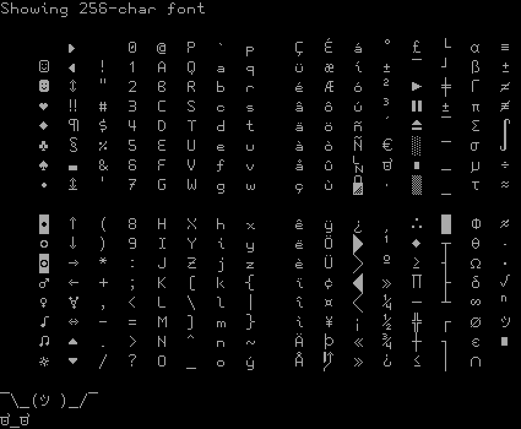

# bynfont
A modern bitmap font for Linux terminal that combines the best features of other very good bitmap fonts.

## About

`bynfont` is a well-balanced mix of modern-looking glyphs, differentiable characters (0/O, l/1), rudimentary Powerline support, and a sleek style more similar to modern programming fonts.

The font uses [Tamzen For Powerline 8x16](https://github.com/sunaku/tamzen-font) as a base and overhauls it, taking the box-drawing characters from [Terminus](https://terminus-font.sourceforge.net/).

Some symbols have been swapped around and replaced for use in emoticons; others have more sensible and commonly-used characters in place of them.



## Installation

This font was edited using [psftools](https://codeberg.org/gnarz/psftools), but does not require it for installation.

### Try It Out!

You can download `bynfont.psfu.gz` directly from Releases. Then, in the Linux console/TTY (`Ctrl` + `Alt` + `F3`..`F6`), navigate to the directory and use `setfont [-d] bynfont.psfu.gz` (`-d` will have is display at double size). This will apply the font to this console until next reboot.

### Install It!

#### Arch Linux, EndeavourOS, Manjaro, etc.

The font is available in the AUR: `yay -S bynfont`

#### Manually

Locate the `consolefonts` directory for your Linux distribution (e.g. `/usr/share/kbd/consolefonts` on Arch-based distros). Place `bynfont.psfu.gz` directly in this directory, then set it with `setfont bynfont`.

To make this change persistent, edit `/etc/vconsole.conf`:

```config
KEYMAP=us
FONT=bynfont
```

Then regenerate your initramfs with `dracut`/`mkinitcpio`.
